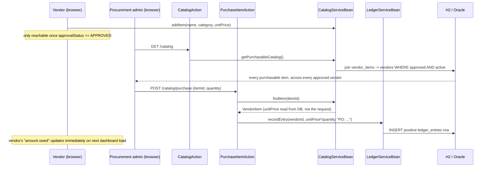

# Vendor Management System

[](https://github.com/kaushalkkumar-debug/customer-account-portal/actions/workflows/build.yml)
[](LICENSE)

A J2EE vendor management system, built to the shape a 2014-2015-era
enterprise procurement app actually had: vendors apply and go through an
approval gate before they can trade, each approved vendor lists a catalog
(software, hardware, laptops, IoT devices, accessories), procurement
raises purchase orders against that catalog, and every PO/payment lands
in a real accounts-payable ledger. Presentation layer in **Struts 1.x**
(JSP/JSTL), business layer as **EJB 3.x session beans**, persistence via
plain JDBC.

## What it actually does

Not a relabeled customer-account app — a real vendor lifecycle:

1. **Vendor application** (`/register`) — company name, category
   (Supplies/Services/Maintenance/Logistics/Professional services),
   contact person, login credentials. Every application starts
   `PENDING`, no exceptions — a vendor can't approve themselves.
2. **Approval queue** (`/admin`) — procurement reviews pending
   applications and approves or rejects each one. Nothing past this
   gate is possible for a vendor that hasn't cleared it.
3. **Catalog** (`/dashboard`, vendor side) — once `APPROVED`, a vendor
   lists items: name, category, unit price, description.
4. **Purchase orders** (`/catalog`, admin side) — procurement browses
   every approved vendor's active catalog and raises a PO against an
   item and quantity. This is what actually drives the vendor's amount
   owed — not the vendor self-reporting invoices.
5. **Accounts-payable ledger** (`/dashboard`, vendor side) — every PO
   is a positive ledger entry ("we owe you this"); every payment
   procurement records is a negative one ("we paid you this"). The
   running total is the vendor's real-time amount owed.

## Class diagram

```mermaid
classDiagram
    class LoginAction { +execute() ActionForward }
    class RegisterAction { +execute() ActionForward }
    class DashboardAction { +execute() ActionForward }
    class AdminAction { +execute() ActionForward }
    class CatalogAction { +execute() ActionForward }
    class PurchaseItemAction { +execute() ActionForward }
    class SubmitInvoiceAction { +execute() ActionForward }
    class AddCatalogItemAction { +execute() ActionForward }
    class SetApprovalStatusAction { +execute() ActionForward }
    class RecordPaymentAction { +execute() ActionForward }
    class ToggleActiveAction { +execute() ActionForward }

    class VendorManagementLocal {
        <<interface>>
        +registerVendor(...) int
        +authenticate(username, password) Optional~VendorAccount~
        +getAccount(accountId) Optional~VendorAccount~
        +setApprovalStatus(accountId, status)
        +setAccountActive(accountId, active)
        +findAllAccounts() List~VendorAccount~
    }
    class VendorManagementBean { <<@Stateless>> }
    class LedgerServiceLocal {
        <<interface>>
        +recordEntry(accountId, amount, description) int
        +getLedgerHistory(accountId) List~LedgerEntry~
        +getAmountOwed(accountId) BigDecimal
    }
    class LedgerServiceBean { <<@Stateless>> }
    class CatalogServiceLocal {
        <<interface>>
        +addItem(accountId, name, category, unitPrice, description) int
        +getVendorCatalog(accountId) List~VendorItem~
        +getPurchasableCatalog() List~VendorItem~
        +findItem(itemId) Optional~VendorItem~
    }
    class CatalogServiceBean { <<@Stateless>> }

    class VendorDao
    class VendorProfileDao
    class LedgerDao
    class VendorItemDao

    class VendorAccount {
        -String companyName
        -VendorCategory category
        -ApprovalStatus approvalStatus
        -boolean active
        +isApproved() boolean
    }
    class VendorProfile { -String contactName -String email }
    class LedgerEntry {
        -BigDecimal amount
        -String description
        +isInvoice() boolean
    }
    class VendorItem {
        -String name
        -ItemCategory category
        -BigDecimal unitPrice
        -boolean active
    }
    class ApprovalStatus { <<enumeration>> PENDING APPROVED REJECTED }
    class VendorCategory { <<enumeration>> SUPPLIES SERVICES MAINTENANCE LOGISTICS PROFESSIONAL_SERVICES }
    class ItemCategory { <<enumeration>> SOFTWARE HARDWARE LAPTOP IOT_DEVICE ACCESSORY }

    RegisterAction --> VendorManagementLocal : registerVendor (always PENDING)
    LoginAction --> VendorManagementLocal : authenticate
    DashboardAction --> VendorManagementLocal
    DashboardAction --> LedgerServiceLocal
    DashboardAction --> CatalogServiceLocal
    AdminAction --> VendorManagementLocal
    SetApprovalStatusAction --> VendorManagementLocal
    ToggleActiveAction --> VendorManagementLocal
    AddCatalogItemAction --> CatalogServiceLocal
    AddCatalogItemAction --> VendorManagementLocal : approval gate
    CatalogAction --> CatalogServiceLocal
    PurchaseItemAction --> CatalogServiceLocal : price lookup
    PurchaseItemAction --> LedgerServiceLocal : positive entry
    SubmitInvoiceAction --> LedgerServiceLocal
    SubmitInvoiceAction --> VendorManagementLocal : approval gate
    RecordPaymentAction --> LedgerServiceLocal : negative entry

    VendorManagementBean ..|> VendorManagementLocal
    LedgerServiceBean ..|> LedgerServiceLocal
    CatalogServiceBean ..|> CatalogServiceLocal
    VendorManagementBean --> VendorDao
    VendorManagementBean --> VendorProfileDao
    LedgerServiceBean --> LedgerDao
    CatalogServiceBean --> VendorItemDao

    VendorDao ..> VendorAccount : returns
    VendorProfileDao ..> VendorProfile : returns
    LedgerDao ..> LedgerEntry : returns
    VendorItemDao ..> VendorItem : returns
    VendorAccount --> ApprovalStatus
    VendorAccount --> VendorCategory
    VendorItem --> ItemCategory
```



## The purchase-order flow



## The approval workflow — why it's the point, not a formality

`ApprovalStatus` (`PENDING`/`APPROVED`/`REJECTED`) is what actually makes
this a *vendor* management system rather than a relabeled customer one. A
customer account is usable the instant it's created; a vendor account
isn't:

- `registerVendor()` sets `PENDING` unconditionally — the constructor
  path has no way to create an already-approved vendor. Only
  `setApprovalStatus()`, called from the admin-only
  `SetApprovalStatusAction`, can move it.
- **Login is deliberately not gated on approval** — a pending vendor
  can still sign in and see their status (`isComparisonAvailable`-style
  bug class avoided by making this an explicit, tested decision, not an
  accident). What *is* gated: `AddCatalogItemAction` and
  `SubmitInvoiceAction` both check `approvalStatus == APPROVED` before
  doing anything, and the catalog itself only surfaces items from
  approved, active vendors (`VendorItemDao.findPurchasableCatalog()`'s
  join enforces this at the query level, not just in a controller
  `if`) — so even a stale link to an unapproved vendor's item can't be
  purchased.
- `active` (existing account status) and `approvalStatus` are
  deliberately separate fields. An approved vendor can later be
  deactivated (contract ended) without losing their approval history —
  reactivating them doesn't re-run the onboarding review.

## Why the ledger sign convention is enforced in two different places

`LedgerEntry.amount`: positive = an invoice (the company owes the
vendor more), negative = a payment (the company paid the vendor). Two
different Struts actions both write to this ledger, and each enforces
the sign a different way rather than trusting the caller:

- `PurchaseItemAction` computes `unitPrice * quantity` from the catalog
  record it just looked up — always positive, never touches the sign.
- `RecordPaymentAction` takes a *positive* amount from the admin form
  ("pay this vendor £500") and negates it right before writing —
  because an admin thinks in terms of "how much am I paying", not "what
  sign does the ledger use".
- `SubmitInvoiceAction` (the vendor's ad-hoc-invoice form, for charges
  not tied to a PO — freight, a correction) explicitly rejects a
  non-positive amount, because a vendor invoicing a negative number
  would be paying the company, which isn't what that form is for.

## Running it

```bash
mvn package
# deploy target/customer-account-portal.war to Tomcat/Jetty, then:
# http://localhost:8080/customer-account-portal/  -> /login.jsp
```

## Layers

| Layer | Technology | Where |
|---|---|---|
| Presentation | Struts 1.x `Action`/`ActionForm`, JSP/JSTL | `struts/`, `webapp/*.jsp` |
| Business | EJB 3.x `@Stateless` session beans | `ejb/` |
| Persistence | Plain JDBC, hand-written DAOs | `dao/`, `db/` |
| Security | Salted SHA-256 password hashing | `security/` |

Three named patterns, not just folders:

1. **MVC via Struts's front controller.** Every `*Action` is a thin
   controller — pull request params, call exactly one EJB method, pick
   a forward. None of them touch JDBC directly.
2. **Session façade (the EJB layer).** `VendorManagementLocal`,
   `LedgerServiceLocal`, and `CatalogServiceLocal` are the *only*
   things a Struts action is allowed to depend on. Eleven actions,
   three interfaces — swap Struts for Spring MVC tomorrow and
   everything below this layer is untouched.
3. **DAO pattern, one per aggregate.** `VendorDao`/`VendorProfileDao`/
   `LedgerDao`/`VendorItemDao` each own exactly one table's SQL.
   Nothing above the EJB layer knows a database exists.

## Why the balance isn't a column

`VendorAccount` has no `amountOwed` field. `LedgerServiceBean.
getAmountOwed()` computes it as `SUM(amount)` over that vendor's ledger
entries, every time it's asked. That's deliberate: a stored balance is
a second source of truth that a bug or a crash mid-update can
desynchronize from the ledger that's supposed to justify it. Deriving
it makes that class of bug structurally impossible — there's only one
number, computed from the same rows a human could add up by hand to
audit it. Cost: `O(n)` per check rather than `O(1)` — the right
trade-off for a vendor ledger, not a high-frequency trading system, and
worth being able to name out loud rather than making silently.

## About the EJB layer

`VendorManagementBean`, `LedgerServiceBean`, and `CatalogServiceBean`
are real `@Stateless`/`@Local`-annotated session beans, tested via
direct instantiation rather than inside a live EJB container — the
era-appropriate container for EJB 3.x (OpenEJB/TomEE, roughly Java EE
6) predates Java 17 by a long way, and getting it to boot reliably here
would be fighting the sandbox rather than testing the module. Each bean
method opens and closes its own JDBC connection rather than relying on
container-managed transactions/injection, so nothing about the tests
depends on being inside a container.

## About the database layer

Same substitution as my other J2EE-era projects: plain ANSI JDBC, H2
in-memory here so the whole thing compiles, runs, and is tested with
nothing but `mvn test`. `VENDOR_DB_URL`/`VENDOR_DB_DRIVER`/
`VENDOR_DB_USER`/`VENDOR_DB_PASSWORD` env vars swap it back to a real
Oracle instance with no code change.

## Password hashing

`PasswordHasher` does salted SHA-256 (per-account random salt,
constant-time comparison on verify) — a correct pattern, but not
production-grade for password storage; SHA-256 is fast, which is
exactly the wrong property for something an attacker might brute-force
offline. A real deployment should use bcrypt, scrypt, or Argon2. Kept
as SHA-256 here to stay dependency-light and focused on the vendor/
EJB/Struts plumbing this project is actually about.

## Tests

```bash
mvn test
```

Real output from this repo — 28 tests, all passing:

```
Running com.example.accounts.ejb.CatalogServiceBeanTest
Tests run: 4, Failures: 0, Errors: 0, Skipped: 0

Running com.example.accounts.ejb.LedgerServiceBeanTest
Tests run: 5, Failures: 0, Errors: 0, Skipped: 0

Running com.example.accounts.ejb.VendorManagementBeanTest
Tests run: 14, Failures: 0, Errors: 0, Skipped: 0

Running com.example.accounts.security.PasswordHasherTest
Tests run: 5, Failures: 0, Errors: 0, Skipped: 0

Tests run: 28, Failures: 0, Errors: 0, Skipped: 0
BUILD SUCCESS
```

- **`VendorManagementBeanTest`** — registration always starting
  `PENDING`, the approval-status transition, that a pending vendor can
  still authenticate, role checks, deactivation/reactivation, profile
  read/update, and duplicate-username rejection.
- **`LedgerServiceBeanTest`** — history ordering, `isInvoice()`
  correctly distinguishing positive from negative entries, amount-owed
  as the sum of all entries, and per-vendor scoping.
- **`CatalogServiceBeanTest`** — adding an item and reading it back,
  and specifically that `getPurchasableCatalog()` excludes a pending
  vendor's items *and* a deactivated vendor's items — the approval gate
  enforced at the query level, not just trusted to a controller `if`.

## Live-verified, not just unit-tested

Deployed the WAR under Jetty and ran the entire lifecycle for real: a
vendor ("Northgate IT Supplies") applied and was correctly blocked from
listing items or invoicing while `PENDING`; procurement approved it;
the vendor listed a laptop (£899.00 x3) and an IoT sensor kit (£249.99
x20); procurement raised both purchase orders and the ledger showed
**£7696.80** owed — the exact `2697.00 + 4999.80`; procurement recorded
a **£2697.00** payment and the vendor submitted a **£45.00** ad-hoc
freight invoice, landing the running total at **£5044.80** —
`7696.80 - 2697.00 + 45.00`, confirmed by hand.

## Roadmap / not included

- A live EJB container in the test suite (see "About the EJB layer")
- Container-managed transactions/security
- No CSS/styling — plain HTML tables and forms, functionality over
  polish
- A production-grade password hash (bcrypt/scrypt/Argon2) in place of
  salted SHA-256
- Multi-line purchase orders (one item per PO here, not a cart)
- Vendor performance scoring / preferred-vendor ranking

## License

MIT — see [LICENSE](LICENSE).
